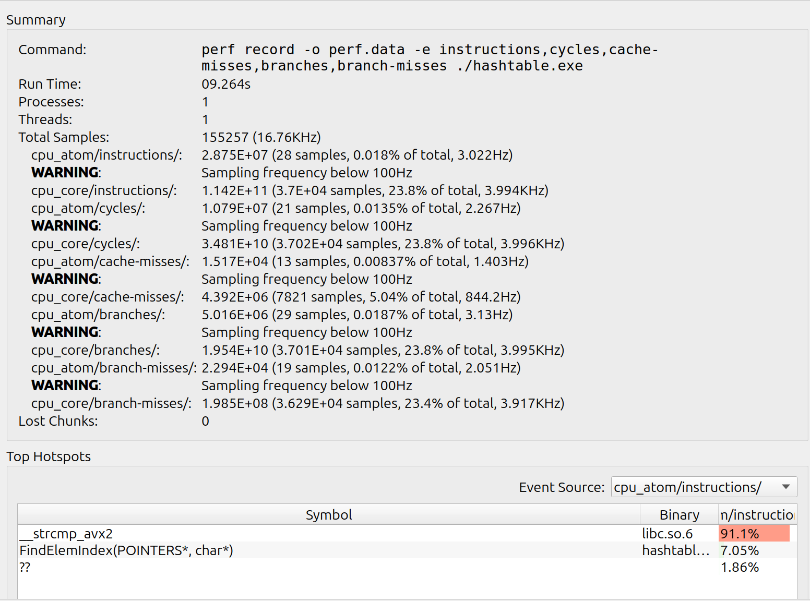

# Исследование оптимизаций кода на примере хеш-таблицы.

## Оглавление
[1. Аннотация](#1-аннотация)    \
[2. Введение](#2-введение)      \
[3. Методика](#3-методика)      \
[4. Результаты](#4-результаты-и-их-обсуждения)  \
[5. Выводы](#5-выводы)          \
[6. Приложение](#6-приложение)  \
[7. Источники информации](#7-источники-информации)

## 1. Аннотация

Цели данной работы:
- Знакомство с профилировочными программами.
- Аппаратно зависимая оптимизация кода хеш-таблицы.

В работе были выполнены такие оптимизации функций поиска, как:

1.  Оптимизация функций с помощью AVX/AVX2 инструкций.  [Подробнее здесь](#-avx-оптимизация-strcmp-)
2.  Оптимизация с использованием ассемблерной вставки.  [Подробнее здесь](#оптимизация-хеш-функции).
3.  Оптимизация при помощи написания функции на языке ассемблер. \
 [Подробнее здесь](#-оптимизация-strcmp--при-помощи-assembler)

Профилировщики, с помощью которых собирались данные: ***kcashegrind***, ***perf***

В результате прирост скорости выполнения программы составил:

| Флаг | Без оптимизаций | С оптимизациями | Прирост |
|------|-----------------|-----------------|---------|
|-O0   | 15.28c          | 4.46c           | 242%    |
|-O3   | 15.143c         | 3.336c          | 354%    |

### | Характеристики CPU

  - **Info**: 12-core (4-mt/8-st) model: 13th Gen Intel Core i5-1340P 
  
 -  **bits**: 64 type: MST AMCP
    arch: Raptor Lake rev: 2 cache: L1: 1.1 MiB L2: 9 MiB L3: 12 MiB


  - **Speed** (MHz): avg: 713 high: 1500 min/max: 400/4600:3400 
  
  - **Flags**: avx avx2 ht lm nx pae sse sse2 sse3 sse4_1 sse4_2 ssse3 vmx#оптимизация-хеш-функции

## 2. Введение

Одной из актуальных проблем человечества является взрывной рост объемов обрабатываемой информации. Ее суть заключается в том, что с большим массивом необработанных данных работать долго и неэффективно. По этой причине были придуманы новые способы хранения и поиска информации. 

Одним из наиболее эффективных методов являются хеш-таблицы.

> 

    Хеш-таблица — это структура данных, в которой все элементы хранятся в виде пары ключ-значение, где:

        ключ — уникальное число, которое используется для индексации значений;
        значение — данные, которые с этим ключом связаны. 
    
    Взято с codechick.io [1]

### | Преимущества хеш-таблиц

При правильном подборе хеширующей функции и размера хеш-таблицы средняя скорость доступа к данным составляет O(1). Но при этом не гарантируется, что время выполнения отдельной операции мало́.

### | Проблемы

Однако, на практике такое случается редко. Не всегда есть возможность подобрать такой тип, размер хеш-таблицы и хеш-функцию, чтобы для каждого уникального элемента выделялся свой ключ и свое место. 

Случай, когда хеш-функция генерирует один ключ для разных элементов данных называется **коллизией**.

Существует несколько способов борьбы с колллизиями:

- *Метод цепочек*. Суть метода заключается в том, что если хеш-функция выделяет один ключ сразу нескольким элементам, то храниться они будут в одном и том же индексе, но уже с помощью двусвязного списка. 
- *Открытая адресация* В отличие от метода цепочек, в открытой адресации несколько элементов в одной ячейке храниться не могут. Суть этого метода заключается в том, что каждая ячейка либо содержит единственный ключ, либо ```NULL```. 

\* Существует несколько видов открытых адресаций. Подробное их описание представлено [здесь](https://codechick.io/tutorials/dsa/dsa-hash-table).

> [!WARNING]
>В данной работе намеренно подобран такой размер хеш-таблицы, что load factor примерно равен 15. Данное допущение обусловлено учебными целями, для того, чтобы аппаратно-зависимые оптимизации были более эффективными.
> 
> В данной работе также не ставится ограничений на безопасность хеш-таблицы, для того, чтобы не сужать круг выбора хеш-функций. 

## 3. Методика

Целью данного исследования является оптимизация поиска в хеш-таблицах. По этой причине требуется подобрать такой размер хеш-таблицы, чтобы load factor был примерно равен 15, что не соответствует load-фактору хороших хеш-таблиц (в которых он равен 1-2). Такое допущение дает возможность без обработки очень больших данных получить информацию об "узких местах" в программе.

Для проведения оптимизаций требуется программа построения хэш-таблиц. В данном исследовании для решения коллизий выбран метод цепочек.

Далее к хеш-таблице требуется подобрать "хорошую" хэширующую функцию. Коэффициент заполнения $α$ позволяет судить о качестве хеш-функции: \
пусть $M = \frac{1}{m} \sum |Index[i]|$
– средняя длина списков; если хеш-функция - "хорошая", то дисперсия $ D = \frac {1}{m} \sum (M - |Index[i]|)^2 \leq \alpha $

В ходе работы требуется выполнять профилировку программы после каждой оптимизации с целью контроля результатов проделанной работы и выявления новых "узких" место. Данный процесс будем повторяться до тех пор, пока он полезен для обучения. 

## 4. Результаты и их обсуждения

Для теста хеш-таблицы был взят текст Льва Толстого "Война и мир", содержащий примерно 680 тысяч слов. Однако уникальных примерно 15 тысяч, если не брать в расчет регистр. Однако данная хеш-таблицы - регистр-зависимая. Поэтому размер хеш-таблицы примем равным 1000.

Далее перейдем к подбору хеш-функции.

В данной работе были рассмотрены:

### | 1. Хеш-функция, вычисляющая длину слова

<details>

<summary> Разверните, чтобы посмотреть код </summary>

```
static inline unsigned int LenghtCalc (const char* elem)
{
    unsigned int hash = 0;

    while (*elem != '\0')
    {
        hash++;
        elem++;
    }

    return hash;
}
```
</details>


Отношение дисперсии $D$ к load-фактору $\alpha$ = 120. Данная хеш-функция не удовлетворяет требованиям к хорошей хеш-функции.

### | Хеш-функция, вычисляющая сумму ASCII символов слова

<details>

<summary> Разверните, чтобы посмотреть код </summary>

```
static inline unsigned int AsciiSumCalc (const char* elem)
{
    unsigned int hash = 0;

    while (*elem != '\0')
    {
        hash += *elem;
        elem++;
    }

    return hash;
}
```
</details>


Видно, что дисперсия в данной функции слишком велика, что также не удовлетворяет требованиям к хорошей хеш-функции.

### | DJB2

<details>

<summary> Разверните, чтобы посмотреть код </summary>

```
static inline unsigned int DJB2Hash (const char* elem)
{
    unsigned int hash = 0;

    while (*elem)
    {
        hash = ((hash << 5) + hash) + (*elem);

        elem++;
    }
    
    return hash;
}
```
</details>


В данной функции распределение элементов уже значительно лучше. Попробуем увеличить размер таблицы.


Видно, что при увеличении хеш-таблицы до 3000 ячеек, растет дисперсия. При дальнейшем масштабировании дисперсия будет только увеличиваться.

### | JENKINS

<details>

<summary> Разверните, чтобы посмотреть код </summary>

```
static inline unsigned int JENKINS (const char* elem)
{
    unsigned int hash = 0;

    while (*elem != '\0')
    {
        hash += (char) *elem++;
        hash += (hash << 10);
        hash ^= (hash >> 6);
    }

    hash += (hash << 3);
    hash ^= (hash >> 11);
    hash += (hash << 15);

    return hash;
}
```
</details>


Данная хеш-функция показывает хорошее распределение. Попробуем увеличить размер хеш-таблицы.


JENKINS - хорошая хеш-функция. Продолжим исследование дальше.

### | Adler-32

<details>

<summary> Разверните, чтобы посмотреть код </summary>

```
static inline unsigned int Adler_32 (const char* elem)
{
    uint32_t s1 = 1;
    uint32_t s2 = 0;
  
    while(*elem != '\0')
    {
        s1 = ( s1 + *( elem++ ) ) % 65521;
        s2 = ( s2 + s1 ) % 65521;
    }
    return ( s2 << 16 ) + s1;
}
```
</details>


На 1000 ячеек у Adler_32 высокая дисперсия. При увеличении до 5000 ячеек дисперсия уменьшается.


Проведем проверку для 500 элементов. 


Видно, что дисперсия растет с уменьшением размера хеш-таблицы.

Данная функция также может быть применена в данной работе.

### | CRC-32


<details>

<summary> Разверните, чтобы посмотреть код </summary>

```
static inline unsigned int CRC32 (const char* elem)
{
    unsigned int hash = 0xFFFFFFFF;

    while (*elem != '\0')
    {
        size_t byte = (char) *elem++;
        hash = (hash >> 8) ^ crc32_table[(hash ^ byte) & 0xFF];
    }

    return hash ^ 0xFFFFFFFF;
}
```
</details>

Данная функция показывает себя лучше Adler-32 на меньших размерах хеш-таблицы. Далее приведены диаграммы.


<details>

<summary> 1. CRC32, размер таблицы 500 элементов.</summary>


</details>

<details>

<summary> 2. CRC32, размер таблицы 1000 элементов.</summary>


</details>

<details>

<summary> 3. CRC32, размер таблицы 5000 элементов.</summary>


</details>

### | Итог

JENKINS, Adler-32 и CRC-32 - наиболее подходящие хеш-функции для данной работы. 

Однако у CRC-32 есть большое преимущество перед остальными двумя. Для CRC-32 существует отдельная assembler команда. Алгоритм легко реализуется с точки зрения аппаратной логики, что обеспечивает высокую скорость работы в программной реализации.  Поэтому в хеш-таблице будет использована CRC-32.

### | Начало оптимизаций профилировщиками

Для сбора данных профилирующими программами функция поиска элементов хеш-таблицы будет вызвана 10 000 000 раз. Это позволит свести к минимуму влияние функции создания хеш-таблицы и сосредоточиться на оптимизации поиска элементов. При увеличении количества итераций возможен значительный прирост погрешности измерений связанный с троттлингом.
```
Троттлинг (от англ. throttling; динамическое изменение частоты) — механизм пропуска части машинных тактов (циклов) в цифровой электронике с целью синхронизации работы различных компонентов (например, в интерфейсе SCSI) или их защиты, в том числе процессора, от термического повреждения при перегреве.

Взято с wikipedia.org[3]
```

При первом запуске программы профилировщик ***kcachegrind*** показал результаты:


\- Результаты из kcashegrind


\- Результаты из perf

| Номер измерения | Время работы |
|-----------------|--------------|
|1                | 15.7c        |
|2                | 15.0c        |
|3                | 15.3c        |
|4                | 15.1c        |
|5                | 15.3c        |


|Итог:            | 15.28c       |
|-----------------|--------------|

Время работы программы составило **15.28** секунды.

Первая функция для оптимизации - strcmp ().

### | AVX оптимизация strcmp ()

Из данных kcachegrind, полученных после оптимизации хеш-функции, видно, что strcmp () занимает 26.45%.

При выборе хеш-функции можно было заметить, что длина одного слова в тексте не превосходит 17 букв. Следовательно, strcmp () не требуется обрабатывать строки длины более 17. Поэтому оптимизацию можно построить на avx/avx2 инструкциях процессора.

Полученный код:

```
bool avx_strcmp (list_elem_t * first_str, list_elem_t second_str)
{
    my_assert (first_str && second_str);

    __m256i __first_str  = _mm256_loadu_si256 (&first_str->list_elem_opt);    
    __m256i __second_str = _mm256_loadu_si256 (&second_str->list_elem_opt);
    
    return ~(_mm256_movemask_epi8 (_mm256_cmpeq_epi8 (__first_str, __second_str)));
}
```
\- Оптимизация strcmp ().

Произведем профилирование повторно.

<details>

<summary> Граф профилирования: </summary>


</details>

<details>

<summary> Данные kcachegrind: </summary>


</details>

<details>

<summary> Данные perf: </summary>


</details>

| Номер измерения | Время работы |
|-----------------|--------------|
|1                | 6.4c         |
|2                | 6.1c         |
|3                | 6.1c         |
|4                | 6.0c         |
|5                | 6.9c         |

|Итог: | 6.30c  |
|------|--------|

Как мы можем видеть, время выполнения программы уменьшилось.

Попробуем улучшить результат.

### | Оптимизация strcmp () при помощи assembler

```
section .text

global asm_avx_strcmp

asm_avx_strcmp:
        push rbp
        mov rbp, rsp

        vmovdqu ymm1, [rdi]
        vpcmpeqb ymm0, ymm1, [rsi]
        vpmovmskb rax, ymm0

        xor rax, 0xffffffff

        mov rsp, rbp
        pop rbp

        ret
```
\- Код strcmp () на языке assembler с использованием ymm регистров.

Произведем профилирование повторно.

<details>

<summary> Граф профилирования </summary>


</details>

<details>

<summary> Данные kcachegrind </summary>


</details>

<details>

<summary> Данные perf </summary>


</details>

| Номер измерения | Время работы |
|-----------------|--------------|
|1                | 5.1c         |
|2                | 5.6c         |
|3                | 5.2c         |
|4                | 5.9c         |
|5                | 5.8c         |

|Итог: | 5.52с  |
|------|--------|


Время выполнения теста уменьшилось. Значит вариант функции на assembler - наилучшая.

### Оптимизация хеш-функции

Как отмечалось при выборе хеш-функции, CRC-32 имеет специальную assembler функцию. Поэтому будет переписана на встроенном assembler.

```
    __asm__(
        ".intel_syntax noprefix         \n\t"
        "                               \n\t"
        "xor rax, rax                   \n\t"
        "                               \n\t"
        "mov eax, 0xffffffff            \n\t"
        "                               \n\t"
        "jmp 0f                         \n\t"
        "                               \n\t"
        "1:                             \n\t"
        "                               \n\t"
        "crc32 eax, byte ptr [%[elem]]  \n\t"
        "inc %[elem]                    \n\t"
        "                               \n\t"
        "0:                             \n\t"
        "                               \n\t"
        "cmp byte ptr [%[elem]], 0      \n\t"
        "                               \n\t"
        "ja 1b                          \n\t"
        "mov %[hash], eax               \n\t"
        "                               \n\t"
        :[hash] "=m"(hash)
        :[elem] "d"(elem)
        :"%rax");
```

\- оптимизированная CRC-32 хеш-функция.

Произведем профилирование повторно.

<details>

<summary> Граф профилирования: </summary>


</details>

<details>

<summary> Данные kcachegrind: </summary>


</details>

<details>

<summary> Данные perf: </summary>


</details>

| Номер измерения | Время работы |
|-----------------|--------------|
|1                | 4.2c         |
|2                | 4.6c         |
|3                | 4.8c         |
|4                | 4.2c         |
|5                | 4.5c         |

|Итог: | 4.46c  |
|------|--------|

Новое время выполнения программы составило **4.46** секунд.

Дальнейший процесс оптимизации хеш-функции и работа с профилировочными программами имеет КПД обучения значительно меньше, чем КПД обучения от проделанной работы. По этой причине исследование заканчивается.

## 5. Выводы
 
По итогам проделанной работы было проведено знакомство с профилировочными программами perf и kcachegrind. Проведены аппаратно зависимые оптимизации хеш-таблицы, результаты которых представлены в таблице:


| Флаг | Без оптимизаций | С оптимизациями | Прирост |
|------|-----------------|-----------------|---------|
|-O0   | 15.28c          | 4.46c           | 242%    |
|-O3   | 15.143c         | 3.336c          | 354%    |

\* Данные ```perf``` смотри в Приложении.

## 6. Приложение



\- Программа без оптимизаций, но с флагом -О3.


\- Оптимизированная программа с флагом -О3.

## 7. Источники информации

[1]. Хеш-таблицы // codechick.io URL: https://codechick.io/tutorials/dsa/dsa-hash-table (дата обращения: 28.04.2025).

[2]. Хеш-функция // ru.wikipedia.org URL: https://ru.wikipedia.org/wiki/%D0%A5%D0%B5%D1%88-%D1%84%D1%83%D0%BD%D0%BA%D1%86%D0%B8%D1%8F (дата обращения: 01.05.2025).

[3]. Троттлинг // ru.wikipedia.org URL: https://ru.wikipedia.org/wiki/%D0%A2%D1%80%D0%BE%D1%82%D1%82%D0%BB%D0%B8%D0%BD%D0%B3 (дата обращения 12.05.2025).
