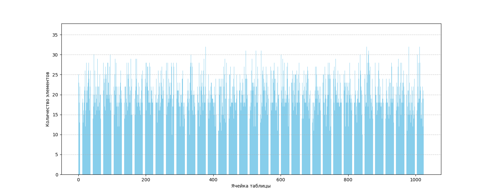

# Исследование оптимизаций кода на примере хеш-таблицы.

## Оглавление
[1. Аннотация](#1-аннотация)    \
[2. Введение](#2-введение)      \
[3. Методика](#3-методика)      \
[4. Результаты](#4-результаты-и-их-обсуждения)  \
[5. Выводы](#5-выводы)          \
[6. Приложение](#6-приложение)  \
[7. Источники информации](#7-источники-информации)

## 1. Аннотация

Цели данной работы:
- Реализация хеш-таблицы.
- Знакомство с профилировочными программами.
- Аппаратно зависимая оптимизация кода хеш-таблицы.

В работе были выполнены такие оптимизации функций поиска, как:

1.  Оптимизация функций с помощью AVX/AVX2 инструкций.  [Подробнее здесь](#-avx-оптимизация-strcmp-)
2.  Оптимизация с использованием ассемблерной вставки.  [Подробнее здесь](#оптимизация-хеш-функции).
3.  Оптимизация при помощи написания функции на языке ассемблера. \
 [Подробнее здесь](#-оптимизация-strcmp--при-помощи-assembler)

Исследование проводилось при помощи таких профилировочных программ, как ***valgtind: kcashegrind***, ***perf: hotspot***

В результате прирост скорости выполнения программы составил:

| Флаг | Без оптимизаций | С оптимизациями | Прирост (До/После) |
|------|-----------------|-----------------|--------------------|
|-O0   | 9.961c          | 2.359c          | 4.222x             |
|-ODef | 9.927c          | 2.329c          | 4.262х             |
|-O3   | 9.264c          | 1.822c          | 5.084x             |

## 2. Введение

Одной из актуальных проблем человечества является взрывной рост объемов обрабатываемой информации. Ее суть заключается в том, что с большим массивом необработанных данных работать долго и неэффективно. По этой причине были придуманы новые способы хранения и поиска информации. 

Одним из наиболее эффективных методов являются хеш-таблицы.

> 

    Хеш-таблица — это структура данных, в которой все элементы хранятся в виде пары ключ-значение, где:

        ключ — уникальное число, которое используется для индексации значений;
        значение — данные, которые с этим ключом связаны. 
    
    Взято с codechick.io [1]

### | Преимущества хеш-таблиц

При правильном подборе хеширующей функции и размера хеш-таблицы средняя скорость доступа к данным составляет O(1). Но при этом не гарантируется, что время выполнения отдельной операции мало́.

### | Проблемы

Однако, на практике такое случается редко. Не всегда есть возможность подобрать такой тип, размер хеш-таблицы и хеш-функцию, чтобы для каждого уникального элемента выделялся свой ключ и свое место. 

Случай, когда хеш-функция генерирует один ключ для разных элементов данных называется **коллизией**.

Существует несколько способов борьбы с колллизиями:

- *Метод цепочек*. Суть метода заключается в том, что если хеш-функция выделяет один ключ сразу нескольким элементам, то храниться они будут в одном и том же индексе, но уже с помощью двусвязного списка. 
- *Открытая адресация* В отличие от метода цепочек, в открытой адресации несколько элементов в одной ячейке храниться не могут. Суть этого метода заключается в том, что каждая ячейка либо содержит единственный ключ, либо ```NULL```.
- *Хеширование кукушки* Основная идея хеширования кукушки — использование двух хеш-функций вместо одной. Также есть вариант алгоритма, в котором используются две хеш-таблицы, и первая хеш-функция указывает на ячейку из первой таблицы, а вторая — из второй.
- *Идеальное хеширование* Использует хэш-функцию без коллизий для набора статических ключей. Идеальная производительность O(1), но сложная в построении.

\
\* Еще больше методов решения коллизий можно найти [здесь](https://codechick.io/tutorials/dsa/dsa-hash-table).

> [!WARNING]
>В данной работе намеренно подобран такой размер хеш-таблицы, что load factor примерно равен 15. Данное допущение обусловлено учебными целями, для того, чтобы аппаратно-зависимые оптимизации были более эффективными.
> 
> В данной работе также не ставится ограничений на безопасность хеш-таблицы, для того, чтобы не сужать круг выбора хеш-функций. 

## 3. Методика

Так как в данной работе проводятся аппаратно-зависимые оптимизации, далее следуют характеристики компьютера, на котором выполнялось исследование:

### | Характеристики ПК

  - **Info**: 12-core (4-mt/8-st) model: 13th Gen Intel Core i5-1340P 

  - **Machine**: ASUSTeK model: K3504VA 

  - **Distro**: Linux Mint 22.1 Xia base: Ubuntu 24.04 noble

  - **Compilers**: gcc: 13.3.0
  
  -  **bits**: 64 type: MST AMCP
    arch: Raptor Lake rev: 2 cache: L1: 1.1 MiB L2: 9 MiB L3: 12 MiB

  - **Speed** (MHz): avg: 713 high: 1500 min/max: 400/4600:3400 
  
  - **Flags**: avx avx2 ht lm nx pae sse sse2 sse3 sse4_1 sse4_2 ssse3 vmx

  - **Disk drive**: speed: 63.2 Gb/s

  - **RAM**: total: 16 GiB note: est. available: 15.25

Взято из: Параметры системы -> Оборудование -> О системе

Для теста хеш-таблицы был взят текст Льва Толстого "Война и мир", содержащий примерно 680 тысяч слов, а уникальных примерно 15 тысяч, если не брать в расчет регистр. Однако данная хеш-таблица - регистр-зависимая.

Далее требуется подобрать такой размер хеш-таблицы, чтобы load factor был примерно равен 15, что не соответствует load-фактору хороших хеш-таблиц (в которых он равен 1-2). Такое допущение дает возможность без обработки очень больших данных получить информацию об "узких местах" в программе. Поэтому размер хеш-таблицы примем равным 1024.

Для проведения оптимизаций требуется программа построения хэш-таблиц. В данном исследовании для решения коллизий выбран метод цепочек.

К хеш-таблице требуется подобрать "хорошую" хэширующую функцию. Коэффициент заполнения $α$ позволяет судить о качестве хеш-функции: пусть $M = \frac{1}{m} \sum |Index[i]|$
– средняя длина списков; если хеш-функция - "хорошая", то дисперсия $D = \frac {1}{m} \sum (M - |Index[i]|)^2 \leq \alpha$

В ходе работы требуется выполнять профилировку программы после каждой оптимизации с целью контроля результатов проделанной работы и выявления новых "узких" мест.

## 4. Результаты и их обсуждения

Перейдем к подбору хеш-функции.

### | 1. Хеш-функция, вычисляющая длину слова

<details>

<summary> Разверните, чтобы посмотреть код </summary>

```
static inline u_int64_t LenghtCalc (const char* elem)
{
    u_int64_t hash = 0;

    while (*elem != '\0')
    {
        hash++;
        elem++;
    }

    return hash;
}
```
</details>


Отношение дисперсии $D$ к load-фактору $\alpha$ = 120, а масштабирование таблицы никак не повлияет на скорость. Данная хеш-функция не удовлетворяет требованиям к хорошей хеш-функции.

### | Хеш-функция, вычисляющая сумму ASCII символов слова

<details>

<summary> Разверните, чтобы посмотреть код </summary>

```
static inline u_int64_t AsciiSumCalc (const char* elem)
{
    u_int64_t hash = 0;

    while (*elem != '\0')
    {
        hash += *elem;
        elem++;
    }

    return hash;
}
```
</details>


На первый взгляд может показаться, что данная хеш-функция имеет неплохое распределение. Однако попробуем увеличить размер хеш-таблицы.


Видно, что при масштабировании данная хеш-функция не заполняет ячейки дальше 2000, значит, не удовлетворяет требованиям к хорошей хеш-функции.

### | DJB2

<details>

<summary> Разверните, чтобы посмотреть код </summary>

```
static inline u_int64_t DJB2Hash (const char* elem)
{
    u_int64_t hash = 0;

    while (*elem)
    {
        hash = ((hash << 5) + hash) + (*elem);

        elem++;
    }
    
    return hash;
}
```
</details>


В данной функции распределение элементов уже значительно лучше. Попробуем увеличить размер таблицы.


Данная хеш-функция хорошо показала себя при масштабировании.

### | JENKINS

<details>

<summary> Разверните, чтобы посмотреть код </summary>

```
static inline u_int64_t JENKINS (const char* elem)
{
    u_int64_t hash = 0;

    while (*elem != '\0')
    {
        hash += (char) *elem++;
        hash += (hash << 10);
        hash ^= (hash >> 6);
    }

    hash += (hash << 3);
    hash ^= (hash >> 11);
    hash += (hash << 15);

    return hash;
}
```
</details>



Данная хеш-функция показывает хорошее распределение. Попробуем увеличить размер хеш-таблицы.


JENKINS - хорошая хеш-функция. Продолжим исследование дальше.

### | Adler-32

<details>

<summary> Разверните, чтобы посмотреть код </summary>

```
static inline u_int64_t Adler_32 (const char* elem)
{
    uint32_t s1 = 1;
    uint32_t s2 = 0;
  
    while(*elem != '\0')
    {
        s1 = ( s1 + *( elem++ ) ) % 65521;
        s2 = ( s2 + s1 ) % 65521;
    }
    return ( s2 << 16 ) + s1;
}
```
</details>


На 10 000 ячеек у Adler_32 хорошая дисперсия. Однако уменьшая размер хеш-таблицы до 1024, получаем следующее:


Как видно, дисперсия сильно выросла. Это может быть вязано с кратностью 1024 многих ключей.

Данная функция не может быть применена в данной работе.

### | CRC-32

<details>

<summary> Разверните, чтобы посмотреть код </summary>

```
static inline u_int64_t CRC32 (const char* elem)
{
    u_int64_t hash = 0xFFFFFFFF;

    while (*elem != '\0')
    {
        size_t byte = (char) *elem++;
        hash = (hash >> 8) ^ crc32_table[(hash ^ byte) & 0xFF];
    }

    return hash ^ 0xFFFFFFFF;
}
```
</details>

Данная функция показывает себя лучше Adler-32 на меньших размерах хеш-таблицы и хорошо ведет себя при масштабировании. Далее приведены диаграммы.

1. CRC32, размер таблицы 1024 элементов.


2. CRC32, размер таблицы 10 000 элементов.


### | Итог

JENKINS, djb2 и CRC-32 - наиболее подходящие хеш-функции для данной работы. 

Однако у CRC-32 есть большое преимущество перед остальными двумя. Алгоритм легко реализуется с точки зрения аппаратной логики, что обеспечивает высокую скорость работы в программной реализации. Поэтому в хеш-таблице будет использована CRC-32.

### | Начало оптимизаций профилировщиками

Для сбора данных профилирующими программами функция поиска элементов хеш-таблицы будет вызвана 10 000 000 раз. Это позволит свести к минимуму влияние функции создания хеш-таблицы и сосредоточиться на оптимизации поиска элементов. При увеличении количества итераций возможен значительный прирост погрешности измерений связанный с троттлингом.
```
Троттлинг (от англ. throttling) — механизм пропуска части машинных тактов (циклов) \
в цифровой электронике с целью защиты защиты различных компонентов, в том числе процессора, от термического повреждения при перегреве.

Взято с wikipedia.org[3]
```
При первом запуске программы профилировщик ***perf*** показал результаты:


\- Результаты из perf

| Номер измерения | Время работы |
|-----------------|--------------|
|1                | 9.264c       |
|2                | 9.270c       |
|3                | 9.259c       |
|4                | 9.249c       |
|5                | 9.282c       |


|Итог:            | 9.264c       |
|-----------------|--------------|

Время работы программы составило **9.264** секунды.

Первая функция для оптимизации - strcmp ().

### | AVX оптимизация strcmp ()

При выборе хеш-функции можно было заметить, что длина одного слова в тексте не превосходит 17 букв. Следовательно, strcmp () не требуется обрабатывать строки длины более 17. Поэтому оптимизацию можно построить на avx/avx2 инструкциях процессора.

Полученный код:

```
bool avx_strcmp (list_elem_t * first_str, list_elem_t second_str)
{
    my_assert (first_str && second_str);

    __m256i __first_str  = _mm256_loadu_si256 (&first_str->list_elem_opt);    
    __m256i __second_str = _mm256_loadu_si256 (&second_str->list_elem_opt);
    
    return ~(_mm256_movemask_epi8 (_mm256_cmpeq_epi8 (__first_str, __second_str)));
}
```
\- Оптимизация strcmp ().

Произведем профилирование повторно.

<details>

<summary> Граф профилирования: </summary>


</details>

<details>

<summary> Данные kcachegrind: </summary>


</details>

<details>

<summary> Данные perf: </summary>


</details>

| Номер измерения | Время работы |
|-----------------|--------------|
|1                | 2.063c       |
|2                | 2.109c       |
|3                | 2.042c       |
|4                | 2.066c       |
|5                | 2.041c       |

|Итог: | 2.640c |
|------|--------|

Как мы можем видеть, время выполнения программы уменьшилось.
Ускорение (Прошлое/Получившееся) составило 3.509х

Следующая функция для оптимизации - CRC32.

### Оптимизация хеш-функции

Как отмечалось при выборе хеш-функции, CRC-32 имеет специальную assembler функцию. Поэтому будет переписана на встроенном assembler.

```
    __asm__(
        ".intel_syntax noprefix         \n\t"
        "                               \n\t"
        "xor rax, rax                   \n\t"
        "                               \n\t"
        "mov eax, 0xffffffff            \n\t"
        "                               \n\t"
        "jmp .strt                      \n\t"
        "                               \n\t"
        ".loop:                         \n\t"
        "                               \n\t"
        "crc32 eax, byte ptr [%[elem]]  \n\t"
        "inc %[elem]                    \n\t"
        "                               \n\t"
        ".strt:                         \n\t"
        "                               \n\t"
        "cmp byte ptr [%[elem]], cst    \n\t"
        "                               \n\t"
        "ja .loop                       \n\t"
        "mov %[hash], eax               \n\t"
        "                               \n\t"
        :[hash] "=m"(hash)
        :[elem] "d"(elem)
        :"%rax");
```

\- оптимизированная CRC-32 хеш-функция.

Произведем профилирование повторно.

<details>

<summary> Граф профилирования: </summary>


</details>

<details>

<summary> Данные kcachegrind: </summary>


</details>

<details>

<summary> Данные perf: </summary>


</details>

| Номер измерения | Время работы |
|-----------------|--------------|
|1                | 1.910c       |
|2                | 1.887c       |
|3                | 1.872c       |
|4                | 1.872c       |
|5                | 1.901c       |

|Итог: | 1.888c |
|------|--------|

Новое время выполнения программы составило **1.888** секунд.
Ускорение (Прошлое/Получившееся) составило 1.395х.

Как мы можем видеть, самое "узкое место" - TestHashTable ().

<details>

<summary> Развернуть, чтобы посмотреть код: </summary>

```
int TestHashTable ()
{
    HASH_TABLE_DATA hash_table = {};

    HashTableInit (&hash_table);

    HashTableCreate (&hash_table);

    for (int i = 0; 100000000 > i; i++)
        FindTheWord (&hash_table, &hash_table.list[i % 967].leaf[i % 5].list_elem);

    HashTableDtor (&hash_table);

    return 1;
}
```

</details>

\
То есть это при больших итерациях - это обертка над FindTheWord (), которая по своей сути - обертка над хеш-функцией и поиском в хеш-таблице.

По этой причине рассмотрим следующую после нее функцию.


### | Оптимизация strcmp () при помощи assembler

Мы уже оптимизировали strcmp (). Посмотрим, как был скомпилирован код оптимизированной функции в assembler с помощью GodBolt.


Как мы можем видеть - компилятор хорошо оптимизировал код. Однако все еще можно побороться за ускорение.

```
section .text

global asm_avx_strcmp

asm_avx_strcmp:
        push rbp
        mov rbp, rsp

        vmovdqu ymm1, [rdi]
        vpcmpeqb ymm0, ymm1, [rsi]
        vpmovmskb rax, ymm0

        xor rax, 0xffffffff

        mov rsp, rbp
        pop rbp

        ret
```
\- Код strcmp () на языке assembler с использованием ymm регистров.

Произведем профилирование повторно.

<details>

<summary> Граф профилирования </summary>


</details>

<details>

<summary> Данные kcachegrind </summary>


</details>

<details>

<summary> Данные perf </summary>


</details>

| Номер измерения | Время работы |
|-----------------|--------------|
|1                | 1.801c       |
|2                | 1.830c       |
|3                | 1.806c       |
|4                | 1.849c       |
|5                | 1.824c       |

|Итог: | 1.822с |
|------|--------|

Время выполнения теста уменьшилось. Однако прирост (Прошлое/Получившееся) составил 1.031х.

Следующими самыми "узкими местами" остаются уже оптимизированные функции. Дальнейшие оптимизации не являются эффективными.

## 5. Выводы
 
По итогам проделанной работы было проведено знакомство с профилировочными программами perf: hotspot и valgrind: kcachegrind. Проведены аппаратно зависимые оптимизации хеш-таблицы, результаты которых представлены в таблице:

| Флаг | Без оптимизаций | С оптимизациями | Прирост (До/После) |
|------|-----------------|-----------------|--------------------|
|-O0   | 9.961c          | 2.359c          | 4.222x             |
|-ODef | 9.927c          | 2.329c          | 4.262х             |
|-O3   | 9.264c          | 1.822c          | 5.084x             |

## 7. Источники информации

[1]. Хеш-таблицы // codechick.io URL: https://codechick.io/tutorials/dsa/dsa-hash-table (дата обращения: 28.04.2025).

[2]. Хеш-функция // ru.wikipedia.org URL: https://ru.wikipedia.org/wiki/%D0%A5%D0%B5%D1%88-%D1%84%D1%83%D0%BD%D0%BA%D1%86%D0%B8%D1%8F (дата обращения: 01.05.2025).

[3]. Троттлинг // ru.wikipedia.org URL: https://ru.wikipedia.org/wiki/%D0%A2%D1%80%D0%BE%D1%82%D1%82%D0%BB%D0%B8%D0%BD%D0%B3 (дата обращения 12.05.2025).

[4]. Perf: hotspot // github.com/KDAB URL: https://github.com/KDAB/hotspot (дата обращения 26.04.2025)

[5]. Valgrind: kcashegrind // kcachegrind URL: https://kcachegrind.sourceforge.net/html/Home.html (дата обращения 26.04.2025)